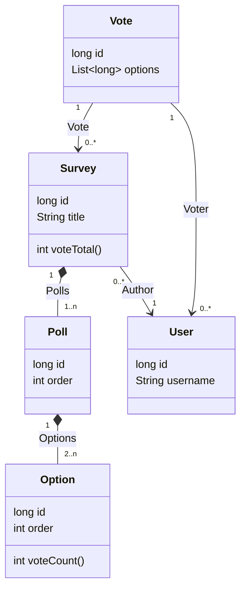

## API

| mapping                 | method | authority                                          |
|-------------------------|--------|----------------------------------------------------|
| /api/users              | GET    | ( $\geq$ Admin )                                   |
| /api/users              | POST   | ( $\geq$ Guest )                                   |
| /api/users/{id}         | GET    | ( $\geq$ User )                                    |
| /api/users/{id}         | PUT    | ( $\geq$ Admin ) OR ( owner of (User \[ id \]) )   |
| /api/users/{id}         | DELETE | ( $\geq$ Admin ) OR ( owner of (User \[ id \]) )   |
| /api/users/{id}/surveys | GET    | ( $\geq$ Guest )                                   |
| /api/users/{id}/votes   | GET    | ( $\geq$ Admin ) OR ( owner of (User \[ id \]) )   |
| /api/surveys            | GET    | ( $\geq$ Guest )                                   |
| /api/surveys            | POST   | ( $\geq$ User )                                    |
| /api/surveys/{id}       | GET    | ( $\geq$ Guest )                                   |
| /api/surveys/{id}       | PUT    | ( $\geq$ Admin )                                   |
| /api/surveys/{id}       | DELETE | ( $\geq$ Admin ) OR ( owner of (Survey \[ id \]) ) |
| /api/votes              | GET    | ( $\geq$ Admin ) OR ( owner of (Vote \[ id \]) )   |
| /api/votes              | POST   | ( $\geq$ Guest )                                   |
| /api/votes/{id}         | GET    | ( $\geq$ Admin ) OR ( owner of (Vote \[ id \]) )   |
| /api/votes/{id}         | PUT    | ( $\geq$ Admin ) OR ( owner of (Vote \[ id \]) )   |
| /api/votes/{id}         | DELETE | ( $\geq$ Admin ) OR ( owner of (Vote \[ id \]) )   |

## Domain



## Data Transfer Objects
### User
```yaml
{
    id: (Number),
    username: "",
    ...(Authorization info)
}
```

### Survey
```yaml
{
    id: (Number),
    author: (User id),
    title: "",
    polls: [
        ...(Poll)
    ]
}
```

### Poll
```yaml
{
    id: (Number),
    question: "",
    options: [
        ...(Option)
    ],
    vote_total: (Number)
}
```

### Option
```yaml
{
    id: (Number),
    option: "",
    vote_count: (Number)
}
```

### Vote
```yaml
{
    id: (Number),
    voter: (User),
    survey: (Survey),
    polls: [
        poll: (Poll id),
        options: [
            ...(Option id)
        ]
    ]
}
```